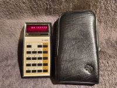
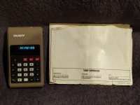
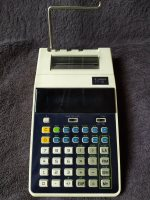

| Brand | Model | Picture |
|-|-|-|
| Texas Instuments | Galaxy 10 | 
| Sharp | ELSI MATE EL-230 | 
| Decimo | Vatman Mini MII | 
| Casio | fx-82TI S-VPAM | 
| Detron | S816MS | 
| Unico | H-884 | 
| Texas Instruments | TI-1200 | 
| Texas Instruments | SR-50A | 
| Texas Instruments | SR-50A | 
| Texas Instruments | TI-51-III | 
| Texas Instruments | TI-2550II | 
| Texas Instruments | SR-51 | 
| Texas Instruments | TI-45 | 
| Novus | Statistician 6030 | 
| Casio | fx-202P | 
| Texas Instruments | TI-30 | 
| Constellation | 808GL | 
| Tandi | EC-380 | 
| Texas Instruments | TI-66 Programmable | 
| Sharp | EL-8005S | 
| Casio | Memory B-1 | 
| APF | Mark 30 | 
| Sperry Remington | ??? | 
| Texas Instruments | TI-510 | 
| Texas Instruments | TI-30X | 
| Casio | HR8A-BK | 
| Casio | fx-82A | 
| Canon | Palmtronic 8M | 
| Sharp | ELSI MATE EL-230 | 
| Sharp | ELSI MATE EL-214 | 
| Texas Instruments | TI-53 | 
| Vanward | ??? | 
| Hewlett Packard | 42S | 
| Commodore | 4109 | 
| Canon | F-73P | 
| top\write | C6602 | 
| Canon | FP-10 | 
| Clover | 5230 | 
| Mindtron | 802DG | 
| Olympia | FT1 | 
| MVB | 403D | 
| Casio | fx-7000G | 
| Sperry Remington | 839M | 
| Casio | SL-880 | 
| Texas Instruments | TI-82 | 
| Canon | P41-D | 
| ??? | ??? | 
| Brother | 408 | 
| Unisonic | 757 | 
| Casio | HR-15 | 
| Casio | pocket-mini P810 | 
| Sperry Remington | 821GT | 
| Tandy | EC-4006 | 
| ??? | ??? | 
| Radio Shack | EC-2001 | 
| Casio | HR-8 | 
| Casio | LC-160ER | 
| Prinztronic | SR99P | 
| Tandy | EC-4005 | 
| Invicta | Electronic Master Mind | 
| Novus | 950 | 
| Adler | 81S | 
| Citizen | LC-503 | 
63 entries in database
